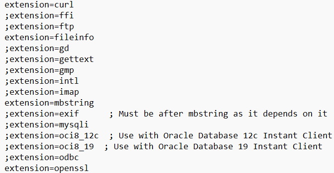
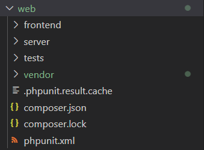

# Tìm hiểu UNIT-TEST(PHP-UNIT) và COMPOSER

## 1. Composer

### Cài đặt Composer.

* truy cập vào đường link : **[download]** *https://getcomposer.org/download/*

* Tiếp theo đó nhấn "Composer-Setup.exe" theo hình bên dưới

---


* Tiếp theo đó máy tính sẽ tải về tệp composer. Kích hoạt tệp đó thêm vào **variable environment** (biến môi trường).

* Tiếp theo Composer bắt chọn phiên bản php để dùng. Chọn phiên bản php mà đã setup từ trước ví dụ PHP-8.2.

* Sau đó Composer yêu cầu một số extension ở php.ini phải được bật ví dụ : 
  +  extension = curl
  + extension = fileinfo
  + extension = mbstring
  + extension = openssl
----


  +  config dir nếu vẫn không nhận 
---


*  Kiếm tra :
----


### Các thành phần của Composer :

* Thành phần : 

---


 1. **Composer.json**
    * Khai báo các thư viện được sử dụng 
    * Phiên bản của các thư viện đó.
    * Cấu hình autoload 
    * Ví dụ :

 ---


    *  Giải thích : trong phần **autoload** phần **psr-4** là một chuẩn trong php giúp ánh xạ thư mục. ví dụ ở đây là **App\\** là namespace : sẽ được ánh xạ tương ứng với thư mục **"server"** trong thư mục thật.
 2. **Composer.lock**
    * Ghi lại chính xác phiên bản của từng thư viện tại thời điểm chạy lệnh 
    * Đảm bảo khi người khác sử dụng có thể hoạt động đúng(Tránh lỗi phiên bản do thư viện gây ra).
 3. **/vendor**
    * Chưa các thư viện được tải về
    * Không đưa nên git (cho vào .gitignore)
    * Không sửa code

### Các lệnh làm việc với composer  : 

*  **composer install** : Tìm kiếm file composer.lock cài đặt các thư viện trong thư mục /vendor. Được dùng khi clone project thì cài đặt thư viện.

* **composer update** : Dùng để cập nhật phiên bản cho thư viện.

* **composer init** : Khởi tạo dự án

* **composer require guzzlehttp/guzzle** : cài một thư viện ví dụ guzzle

## Mục đích của composer

* Quản lý các thư viện

* Đồng bộ phiên bản môi trường giữa các máy khi chạy dự án.

* Tránh phải require_one thủ công 

## Cơ chế Autoload, Chuẩn PSR-4

* Cơ chế Autoload: file chỉ được nạp vào bộ nhớ ngay tại thời điểm class đó được gọi lần đầu tiên. Nếu class không được gọi thì file không được nạp.

* require_one : thì nạp thời điểm biên dịch (**compline time**), tức là sẽ nạp ngay cả khi class đó không được sử dụng.

### Chuẩn PSR-4 :

* Một  class sẽ có dạng như sau  \<NamespaceName>(\<SubNamespaceNames>)*\<ClassName>

**Quy tắc ánh xạ**

* Prefix (Tiền tố): Một phần đầu của Namespace (thường là Vendor\Package) sẽ được map cố định vào một Thư mục gốc (Base Directory).

* Phần còn lại: Các Namespace con phía sau sẽ tương ứng với các thư mục con bên trong thư mục gốc.

* Tên Class: Tương ứng với tên file .php (phân biệt hoa thường).

Ví dụ 

```php
"autoload": {
    "psr-4": {
        "Acme\\Log\\": "./src/"
    }
}
```

* Ở đây **namepsace** là Acme/Log và **thư mục gốc** là src

* Ví dụ một namespace được sử dụng có dạng là : **Acme\Log\Writer\File** : Ban đầu nó xác định phần đầu là namespace **Acme\Log** như được khai báo phần, và phần còn lại là **Writer\File**. Tiếp theo thay namespace bằng **src**. Và **File** sẽ chuyển thành **File.php**. Cuối cùng thu được đường dẫn vật lý là **./src/Wrtier/File.php**

* Lưu ý rằng php có phân biệt chữ hoa, chữ thường. Tuy nhiên trên window vẫn có thể hiểu được nếu tên đặt thư mục là writer. Tuy nhiên trên hệ điều hành linux sẽ không nhận writer. Do đó nên để chuẩn theo chuẩn PSR-4.

-------

# PHP UNIT - UNIT TEST

Khi viết unit test có thể có 3 kịch bản : 

1. **Happy Case** (Kịch bản đẹp)

* Input chuẩn, output chuẩn. Đây là trường hợp 80% người dùng gặp.

* Mục đích : Chứng minh logic hoạt động đúng, tính năng cơ bản được đáp ứng.

2. **Edge Case** ( Kịch bản ngoại lệ) 

* Những trường hợp "Ngoại lệ" Ví dụ như nhập mảng rỗng[] hoặc nhập số 0 cho phép tính / ,....

3. **Error Case** (Kịch bản lỗi)

* Cố tình truyển lỗi vào hàm ví dụ : null, String vào hàm toàn số,....

* Đảm bảo dù có lỗi, nhưng vẫn xử lý tránh bị treo, sập hệ thống,...


Các hàm kiểm tra hay được sử dụng trong php unit : 

* **assertEquals($expected,$actual)** : Kiểm tra xem kết quả trả về có giống kết quả mong đợi không.

* **assertSame($expected,$actual)** : So sánh tuyệt đối(cả kiểu dữ liệu và giá trị) - khắt khe hơn assertEquals.

* **assertCount($number,$expected)** : Kiểm tra số lượng phần tử trong mảng.

* **assertEmpty($actual)** : Kiểm tra biến có rỗng không

* **assertNull($actual)** : Kiểm tra biến có null không

* **assertArrayHasKey($key, $array)** : Kiểm tra mảng có chứa key này hay không. Ví dụ assertArrayHasKey('status',$response); Api này phải có key là status.

* **expectException($class)** : Kiểm tra code có trả exception hay không. Ví dụ : expectException(InvalidArgumentException::class) khi chia cho 0.

* **assertTrue($condition)** : Kiểm tra kết quả phải bắt buộc là true. Ví dụ assertTrue(is_array($result)) : (Kết quả phải là mảng.)

* **assertFalse($condition)** : Kiểm tra kết quả bắt buộc phải là false. Ví dụ assertFalse(empty($result)) : Kết quả false của hàm empty thì pass. Tức là hàm này kiểm tra kết quả không được empty.


----
## Các kỹ thuật khi viết unit test

Tìm hiểu về các khái niệm Stub,Mock.

1. **Stub**

* Mục đích : Giả lập dữ liệu trả về. Không quan tâm làm sao lấy nó được, chỉ cần biết nó trả về gì.

2. **Mock** 

* Mục đích : Kiểm tra xem một hành động CÓ ĐƯỢC GỌI HAY KHÔNG.


## Quy Trình để viết một test case chuẩn : 

* Bước 1 : Arrange(chuẩn bị) : khởi tạo object, giả lập dữ liệu (Mock/Stub).

* Bước 2 : Stub (thực hiện) : gọi hàm cần test

* Bước 3 : Assert(Khẳng định) : so sánh kết quả với output mong đợi.

Ví dụ : 

----


* Đây là kiểu test đơn giản nhất. Kiểm tra nội bộ trong hàm không liên quan đến bên nào khác. Nên không cần dùng các kỹ thuật như là Mock/Stub. Kiểu test này gọi là **Pure Function**.

## Khi nào nên viết unit test

Dấu hiệu nhận biết khi nào cần viết unit test

* Khi tính toán, xử lý logic nghiệp vụ

* Có các điều kiện rẽ nhánh (Decision Making)

* Các hàm Utility/Helper : các hàm dùng chung cho cả dự án.

* Khi fix bug : Khi phát hiện một lỗi, viết một testcase mô tả lỗi đó.Đảm bảo không còn xuất hiện lỗi đó nữa.

## Các lưu ý khi viết unit test

* Nếu hàm dùng phương thức static. Thì dùng **Class::method** để dùng hàm. Tránh việc khởi tạo bằng từ khóa **new Class()**.

* Các test được viết vào thư mục web/tests

* để chạy các test :

Bước 1 : cd vào thư mục web

Bước 2 : chạy các lệnh sau 

***php vendor/bin/phpunit tests/SortAlgorithmTest.php***

---


***php vendor/bin/phpunit tests/SearchAlgorithmTest.php***

---


***php vendor/bin/phpunit tests/GreedyAlgorithmTest.php***

---


