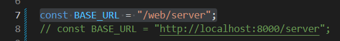

# Algorithm Lab - PHP & Vanilla JS Implementation

## 1. Giới thiệu (Introduction)
Dự án web ứng dụng mô phỏng trực quan các thuật toán phổ biến (Sorting, Search, Recursion, Greedy). Hệ thống được xây dựng theo mô hình Client-Server, sử dụng PHP thuần cho Backend và Vanilla JS cho Frontend.

## 2. Tính năng chính (Features)
- **Sorting:** QuickSort, InsertionSort, CountingSort, BigSorting (xử lý số lớn dạng chuỗi).
- **Searching:** Search Missing Number, Search Using Dictionary.
- **Recusion:** The PowerSum
- **Greedy:** MinimumAbsoluteDiffrence
- **Validation:** Kiểm tra input chặt chẽ ở phía Client (số âm, ký tự đặc biệt).
- **Explanation:** Cung cấp lời giải thích từng bước (step-by-step) cho kết quả thuật toán.

## 3. Kiến trúc hệ thống (Architecture)
- **Frontend:** HTML5, CSS3, ES6 Modules. Sử dụng Facade Pattern để quản lý luồng sự kiện.
- **Backend:** PHP 7.4/8.0+.
    - **Design Pattern:** Factory Method (để khởi tạo thuật toán).
    - **Middleware:** Tách biệt lớp xử lý Request và Response.

## 4. Cài đặt và Chạy (Installation & Usage)

### Yêu cầu tiên quyết
- PHP 7.4 trở lên.
- Web Server (Apache/Nginx) hoặc PHP built-in server.

### Các bước thực hiện
1. Clone dự án:
   ```bash
   git clone [https://github.com/asssjdjd/DS_and_algorithyms.gitt](https://github.com/asssjdjd/DS_and_algorithyms.git)
   ```
   
2. Chuyển vào thư mục web
    ```bash
    cd web
    ```

    ```bash
    php -S localhost:8000
    ```



3. Truy cập trình duyệt : 
* Truy cập trình duyệt: Mở http://localhost:8000/web/frontend/index.html


## 5. Cấu trúc thư mục (Folder Structure)

* web/frontend: Mã nguồn giao diện.

* web/server/algorithyms: Chứa logic thuật toán thuần túy (Core).

* web/server/service: Các Service xử lý nghiệp vụ và Factory.

* web/server/middleware: Chuẩn hóa dữ liệu đầu vào/đầu ra.

## 6. Chi tiết hơn về Web truy cập vào README.md ở frontend và server