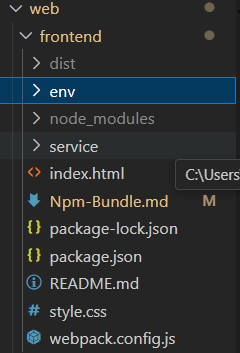

#  Architecture & Core Technologies

Tài liệu này giải thích chi tiết về kiến trúc Frontend của dự án, tập trung vào hai trụ cột chính: **npm** (Quản lý gói) và **Webpack** (Đóng gói mã nguồn).

---
## 1. npm (Node Package Manager) - Hệ Thống Quản Lý

**npm** đóng vai trò là "chuỗi cung ứng" cho dự án, giúp quản lý các thư viện bên ngoài và quy trình vận hành.

###  Kiến trúc thành phần
Hệ sinh thái npm trong dự án bao gồm 3 phần chính:

| Thành phần | Vai trò & Chức năng |
| :--- | :--- |
| **The Registry** | "Nhà kho" trên đám mây chứa hàng triệu thư viện (React, Webpack, Babel...). |
| **CLI (Terminal)** | Công cụ dòng lệnh cài đặt trên máy, giúp giao tiếp với Registry (VD: `npm install`, `npm run build`). |
| **Project Meta-data** | File `package.json` và `package-lock.json`. Đây là bản thiết kế ghi lại danh sách "nguyên liệu" cần thiết để dự án hoạt động. |

###  Công dụng cốt lõi
1.  **Dependency Management (Quản lý phụ thuộc):** Tự động tải và giải quyết xung đột phiên bản giữa các thư viện.
2.  **Version Locking:** Đảm bảo tính nhất quán của môi trường phát triển trên mọi máy tính thông qua `package-lock.json`.
3.  **Script Runner:** Đơn giản hóa các lệnh phức tạp thành các short-command dễ nhớ (VD: `npm run dev` thay vì phải gõ lệnh Webpack dài).

---

## 2. Bundling (Webpack) - Bộ Máy Xử Lý Mã Nguồn

**Webpack** là trái tim của quy trình Build. Nó đóng vai trò là "nhà máy chế biến", chuyển đổi mã nguồn development thành sản phẩm production tối ưu.

##  Công dụng thực tế của Bundling (Why Bundle?)

### 1. Tối ưu hóa hiệu năng tải trang (Performance Optimization)
* **Giảm số lượng HTTP Requests:** Thay vì trình duyệt phải gửi hàng trăm yêu cầu để tải từng file `.js`, `.css` nhỏ lẻ, Bundler gộp chúng lại thành 1-2 file duy nhất (Bundle).
* **Nén dung lượng (Minification):** Tự động loại bỏ các khoảng trắng, dấu xuống dòng, chú thích (comments) và đổi tên biến dài thành ngắn (a, b, c...) để file nhẹ nhất có thể.
* **Caching thông minh:** Sử dụng cơ chế `[contenthash]`. Khi nội dung file thay đổi, tên file sẽ đổi -> Trình duyệt tự động tải bản mới. Nếu không đổi, trình duyệt dùng bản lưu trong cache -> Web tải siêu tốc.

### 2. Tương thích đa trình duyệt (Cross-Browser Compatibility)
* **Transpiling (Dịch mã):** Thông qua **Babel**, Bundler cho phép lập trình viên viết code Javascript hiện đại (ES6+, Arrow Functions, Async/Await) nhưng vẫn chạy mượt mà trên các trình duyệt cũ (như Internet Explorer, Safari đời cũ) bằng cách dịch về ES5.
* **Polyfilling:** Tự động bổ sung các hàm mà trình duyệt cũ còn thiếu.

### 3. Loại bỏ mã thừa (Tree Shaking)
* Tưởng tượng bạn import một thư viện toán học nặng 1MB nhưng chỉ dùng duy nhất hàm `cộng`.
* **Tree Shaking** là thuật toán thông minh của Webpack giúp "rung cây" để rụng đi những phần code chết (Dead Code) không được sử dụng, đảm bảo file cuối cùng không chứa rác.

### 4. Quản lý Module & Scope (Module Management)
* **Tránh xung đột biến toàn cục:** Trong JS thuần cũ, nếu 2 file cùng đặt tên biến là `user`, web sẽ bị lỗi. Bundler đóng gói từng file vào các phạm vi (scope) riêng biệt, đảm bảo an toàn tuyệt đối.
* **Tổ chức code khoa học:** Cho phép chia nhỏ dự án thành hàng trăm module nhỏ dễ bảo trì, nhưng khi chạy thì vẫn là một khối thống nhất.

### 5. Xử lý tài nguyên tĩnh (Asset Management)
* Không chỉ JS, Webpack coi mọi thứ (CSS, Hình ảnh, Font chữ) là các **Module**.
* Nó có thể tự động nén ảnh, chuyển ảnh nhỏ thành dạng base64 (nằm trực tiếp trong code JS) để giảm tải cho Server.

---


#  Project Configuration & Dependencies

Tài liệu này giải thích chi tiết về cấu hình quản lý gói (`package.json`), bao gồm các lệnh thực thi (Scripts) và vai trò của từng thư viện được sử dụng trong dự án.

## 1. NPM Scripts (Lệnh thực thi)

Dự án sử dụng `cross-env` để đảm bảo các lệnh chạy ổn định trên mọi hệ điều hành (Windows/MacOS/Linux).

| Lệnh (Command) | Cú pháp | Công dụng & Ý nghĩa |
| :--- | :--- | :--- |
| **`npm run dev`** | `webpack serve` | **Chế độ Phát triển (Development Mode):**<br><ul><li>Khởi động Server ảo tại `localhost:3000`.</li><li>Kích hoạt tính năng **Hot Module Replacement (HMR)**: Tự động cập nhật giao diện khi sửa code mà không cần reload trang.</li><li>Sử dụng Source Map để dễ dàng debug lỗi.</li></ul> |
| **`npm run build`** | `webpack` | **Chế độ Đóng gói (Production Mode):**<br><ul><li>Kích hoạt tối ưu hóa hiệu năng (Minification, Tree Shaking).</li><li>Tách CSS và JS ra các file riêng biệt.</li><li>Thêm mã hash vào tên file để tối ưu Cache trình duyệt.</li><li>Xuất kết quả cuối cùng ra thư mục `/dist`.</li></ul> |
| **`npm run watch`** | `webpack --watch` | **Chế độ Theo dõi (Watch Mode):**<br><ul><li>Tự động build lại code mỗi khi lưu file, nhưng **không** khởi tạo server ảo.</li><li>Thường dùng khi muốn kiểm tra file output mà không cần chạy server.</li></ul> |

---

## 2. DevDependencies (Thư viện phát triển)

Các thư viện này chỉ phục vụ quá trình Build và Development, không đi kèm trong sản phẩm cuối cùng.

###  Webpack Core (Bộ lõi)
* **`webpack`**: Engine chính chịu trách nhiệm đóng gói toàn bộ mã nguồn.
* **`webpack-cli`**: Công cụ dòng lệnh giúp chạy các lệnh webpack từ terminal.
* **`webpack-dev-server`**: Tạo server cục bộ để phục vụ quá trình development (dùng cho lệnh `npm run dev`).

###  Transpilers & Compatibility (Trình dịch mã)
Giúp code Javascript hiện đại chạy được trên mọi trình duyệt.
* **`@babel/core`**: Trình biên dịch lõi của Babel.
* **`@babel/preset-env`**: Bộ quy tắc thông minh giúp tự động dịch ES6+ về ES5 dựa trên trình duyệt mục tiêu.
* **`babel-loader`**: Cầu nối giúp Webpack giao tiếp với Babel để xử lý các file `.js`.

###  Styling Processors (Xử lý giao diện)
* **`css-loader`**: Cho phép Webpack hiểu và import file CSS vào trong Javascript (`import './style.css'`).
* **`style-loader`**: (Dùng trong Dev) Nhúng CSS trực tiếp vào thẻ `<style>` trong HTML để load nhanh.
* **`mini-css-extract-plugin`**: (Dùng trong Build) Tách CSS ra thành file `.css` riêng biệt để tải song song với JS.
* **`css-minimizer-webpack-plugin`**: Nén file CSS (xóa khoảng trắng, gộp rule) để giảm dung lượng file.

### Utilities & Plugins (Công cụ tiện ích)
* **`html-webpack-plugin`**: Tự động tạo file `index.html` trong thư mục `dist` và tự động chèn thẻ `<script>`, `<link>` trỏ tới file bundle mới nhất.
* **`dotenv-webpack`**: Cho phép đọc các biến môi trường từ file `.env` (như API Endpoint, Key bảo mật) và tiêm vào code dự án.
* **`cross-env`**: Giúp thiết lập biến môi trường (như `NODE_ENV=production`) một cách an toàn, tránh lỗi cú pháp khi chạy trên Windows (PowerShell/CMD).

---

### Cấu hình

1. **Cấu hình thư mục**

---


2. **Cấu hình file package.json**

```json
{
  "name": "frontend",
  "version": "1.0.0",
  "description": "Frontend - Algorithm Lab",
  "main": "index.js",
  "scripts": {
    "dev": "cross-env NODE_ENV=development webpack serve",
    "build": "cross-env NODE_ENV=production webpack",
    "watch": "cross-env NODE_ENV=development webpack --watch"
  },
  "keywords": [],
  "author": "",
  "license": "ISC",
  "devDependencies": {
    "@babel/core": "^7.28.6",
    "@babel/preset-env": "^7.28.6",
    "babel-loader": "^10.0.0",
    "cross-env": "^10.1.0",
    "css-loader": "^7.1.2",
    "css-minimizer-webpack-plugin": "^7.0.4",
    "dotenv-webpack": "^8.1.1",
    "html-webpack-plugin": "^5.6.0",
    "mini-css-extract-plugin": "^2.10.0",
    "style-loader": "^4.0.0",
    "webpack": "^5.90.0",
    "webpack-cli": "^5.1.4",
    "webpack-dev-server": "^4.15.1"
  }
}

```

***Giải thích***

+ **npm run dev** : ứng với lệnh ***cross-env NODE_ENV=development webpack serve*** : chạy với môi trường development và chạy lệnh webpack server giúp giữ lại source maps giúp debug dễ dàng hơn. serve sẽ chạy ứng dụng trên RAM, hỗ trợ Hot Module Replacement (HMR).

+ **npm run build** : ứng với lệnh ***cross-env NODE_ENV=production webpack*** : chạy ứng dụng với môi trường production.Webpack sẽ kích hoạt các optimization: nén JS, nén CSS (nhờ css-minimizer).

+ **npm run watch** : ứng với lệnh ***cross-env NODE_ENV=development webpack --watch*** : chạy môi trường development.Theo dõi thay đổi file và build lại, nhưng không tạo server. Thường dùng khi bạn tích hợp với một backend server khác (như PHP, Python) và chỉ cần Webpack build ra file tĩnh.


3. **Cấu hình bundle : Sử dụng webpack** 

```javascript
const path = require('path');
const HtmlWebpackPlugin = require('html-webpack-plugin');
const MiniCssExtractPlugin = require('mini-css-extract-plugin');
const CssMinimizerPlugin = require('css-minimizer-webpack-plugin');
const Dotenv = require('dotenv-webpack');

const isDev = process.env.NODE_ENV === 'development';

module.exports = {
  
  mode: isDev ? 'development' : 'production',  
  devtool: isDev ? 'source-map' : false,

  entry: './service/FacadeAlgorithyms.js',

  output: {
    path: path.resolve(__dirname, 'dist'),
    filename: isDev ? 'js/bundle.js' : 'js/[name].[contenthash].js',
    clean: true, 
    assetModuleFilename: 'assets/[name].[hash][ext]',
  },

  module: {
    rules: [
      {
        test: /\.css$/i,
        use: [
          isDev ? 'style-loader' : MiniCssExtractPlugin.loader,
          'css-loader',
        ],
      },
      

      {
        test: /\.m?js$/,
        exclude: /node_modules/,
        use: {
          loader: 'babel-loader',
          options: {
            presets: ['@babel/preset-env'],
          },
        },
      },
      
      {
        test: /\.(png|svg|jpg|jpeg|gif)$/i,
        type: 'asset/resource',
      },
    ],
  },

  // 6. Plugins: Các công cụ hỗ trợ build

  plugins: [
    new HtmlWebpackPlugin({
      template: './index.html',
      filename: 'index.html',
      inject: 'body', 
    }),
  
    !isDev && new MiniCssExtractPlugin({
      filename: 'css/[name].[contenthash].css',
    }),
    
    new Dotenv({
      path: isDev ? './env/.env.development' : './env/.env.production', // Chọn file dựa trên mode
      safe: false, 
      systemvars: true, 
    }),
  ].filter(Boolean), 

  optimization: {
    minimize: !isDev, 
    minimizer: [
      '...', 
      new CssMinimizerPlugin(), 
    ],
  },

  devServer: {
    static: {
      directory: path.join(__dirname, 'dist'),
    },
    compress: true,
    port: 3000,
    hot: true,
    open: true,
    proxy: {
      '/server': {
        target: 'http://localhost:8000',
        pathRewrite: { '^': '' },
        changeOrigin: true,
      },
    },
  },
};
```

***Giải thích về file webpack.config.js***

```javascript
const isDev = process.env.NODE_ENV === 'development';
// Lưu một biến isDev đại diện cho môi trường development đang được bật.
```

```javascript
entry: './service/FacadeAlgorithyms.js',
// Định nghĩa đầu vào là file FacadeAlgorithums.js
output: {
    path: path.resolve(__dirname, 'dist'), // Định nghĩa đầu ra ở thư mục nào.
    filename: isDev ? 'js/bundle.js' : 'js/[name].[contenthash].js/bundle.js',
    // Kiểm tra nếu môi trường là Dev 
    // Dùng file cố định bundle.js cố định tên để build nhanh.
    
    // Nếu môi trường là product
    // [name].[contenthash].js. contenthash là chuỗi ký tự ngẫu nhiên (VD: main.a7b8c9.js) được sinh ra dựa trên nội dung file
    clean: true,
    assetModuleFilename: 'assets/[name].[hash][ext]',
},
```

```javascript
 // giúp webpack có thể xử lý các file khác ngoài các file javascrpt và json.
 module: {
    rules: [
      {
        test: /\.css$/i, // giúp lọc các file có đuổi .css
        use: [
          isDev ? 'style-loader' : MiniCssExtractPlugin.loader,
          'css-loader',
        ], 
        // ban đầu sử dụng css-loader để biến file css thành chuỗi văn bản mà webpack hiểu được.

        // Nếu môi trường là dev dùng kiểu style-loader : giúp hỗ trợ sửa file mà không reload lại trang, nhưng file html sẽ bị phình to.

        // Nếu không môi trường dev tách chuỗi css ra khỏi js và ghi vào một file riêng. Giúp trình duyệt tải song song file js và css, giúp nhẹ hơn, nhanh hơn.
      },
      
      {
        test: /\.m?js$/, // áp dụng cho file .js và .mjs
        exclude: /node_modules/, // lệnh này giúp không dịch code trong thư mục node_modules.
        use: {
          loader: 'babel-loader', // sử dụng thư viện babel để thông dịch file .js
          options: {
            presets: ['@babel/preset-env'],
          },
        },
      },
      
      {
        test: /\.(png|svg|jpg|jpeg|gif)$/i, // xử lý các file có định dạng ảnh
        type: 'asset/resource',
      },
    ],
  },
```

```javascript
plugins: [
    new HtmlWebpackPlugin({
      template: './index.html', // nhận file đầu vào là index.html
      filename: 'index.html', // tên file đầu ra ở thư mục dist
      inject: 'body',  // vị trí chèn thẻ script
    }),
  
    !isDev && new MiniCssExtractPlugin({ 
        // Nếu không phải môi trường dev thì mới chạy plugin này.
      filename: 'css/[name].[contenthash].css',
    }),
    
    // Đọc các biến (như API_URL, FIREBASE_KEY) từ file .env và nhúng vào code thông qua process.env.TEN_BIEN

    // nếu môi trường dev thì đọc trong file env.development

    // nếu môi trường product thì đọc ở file env.production
    new Dotenv({
      path: isDev ? './env/.env.development' : './env/.env.production', // Chọn file dựa trên mode
      safe: false, 
      systemvars: true, 
    }),
  ].filter(Boolean),
  ```


  ```java script

  devServer: { 
    // giúp cấu hình chạy được trên cả máy tính các nhân localhost.
    static: {
      directory: path.join(__dirname, 'dist'), 
    },
    compress: true, // Server sẽ nén nhỏ các file giúp tăng tốc độ.
    port: 3000,
    hot: true, // giúp cập nhật trang web ngay lập tức mà không cần phải load lại trang.
    open: true, // tự động bật trình duyệt khi chạy npm run dev.

    // cấu hình nơi nhận ở server.
    proxy: {
      '/server': {
        target: 'http://localhost:8000',
        pathRewrite: { '^': '' },
        changeOrigin: true,
      },
    },
  ```